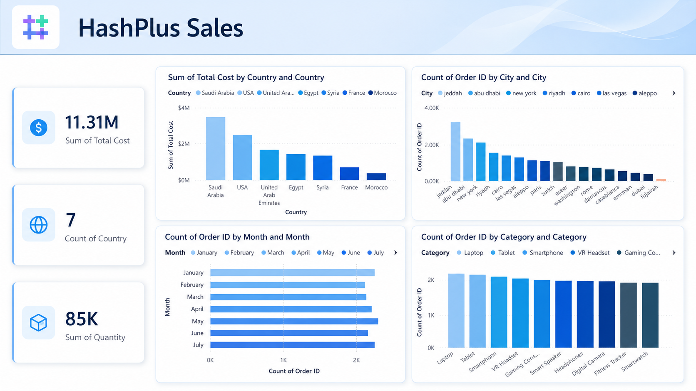

# HashPlus Sales Data Analysis & Dashboard

## Project Overview
This project analyzes sales data using Python and presents the results through an interactive Power BI dashboard.

The main goal is to clean, explore, and analyze the dataset, then build a clear business dashboard that helps understand sales performance across countries, cities, months, and product categories.

## Dashboard Preview

## Tools Used
- Python
- Jupyter Notebook
- pandas
- NumPy
- matplotlib
- seaborn
- Excel
- Power BI
- Power Query
- DAX

## Project Workflow
1. Imported and explored the dataset using Python.
2. Cleaned and prepared the data for analysis.
3. Performed exploratory data analysis using Jupyter Notebook.
4. Used Python libraries to analyze trends and patterns.
5. Built an interactive dashboard in Power BI.
6. Presented key metrics and insights in a business-friendly format.

## Key Metrics
- Total Cost
- Total Quantity
- Count of Countries
- Count of Orders by City
- Monthly Order Trends
- Product Category Analysis

## Insights
- Saudi Arabia had the highest total cost compared to other countries.
- Jeddah recorded the highest number of orders among the listed cities.
- Laptop and Tablet categories showed strong order volume.
- Monthly orders were relatively stable across the analyzed period.

## What I Learned
- How to clean and prepare data using Python.
- How to use pandas and NumPy for data analysis.
- How to explore data using Jupyter Notebook.
- How to create visualizations using matplotlib and seaborn.
- How to build business dashboards using Power BI.
- How to convert raw data into clear business insights.

## Project Files
- Jupyter Notebook file
- Dataset
- Power BI dashboard file
- Dashboard screenshot
